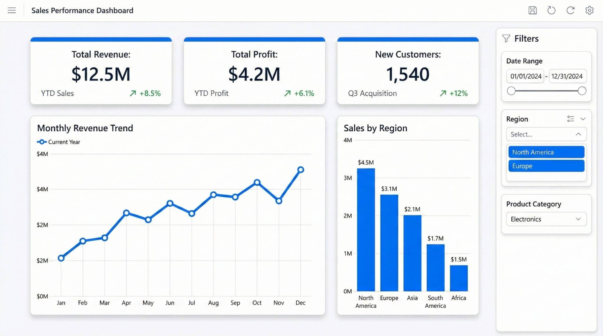

# 📊 Sales Performance Dashboard

## KPI as a single data points/Small charts

## Project Overview

This Power BI dashboard analyzes sales performance across different regions and product categories.

### KPIs
- Total Revenue
- Total Profit
- New Customers

### Visuals
- Monthly Revenue Trend
- Sales by Region
- Date Filter
- Region Filter
- Product Category Filter

### Tools Used
- Power BI
- DAX
- Power Query
- Excel
